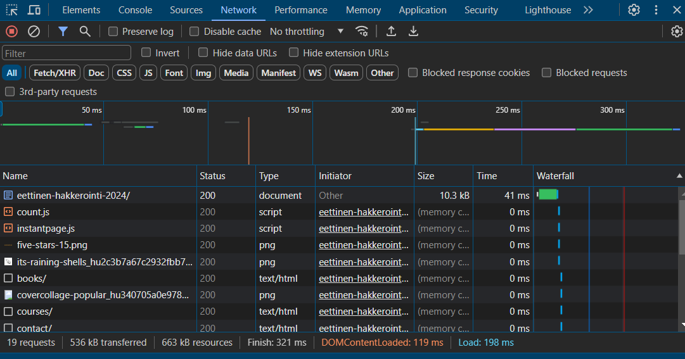
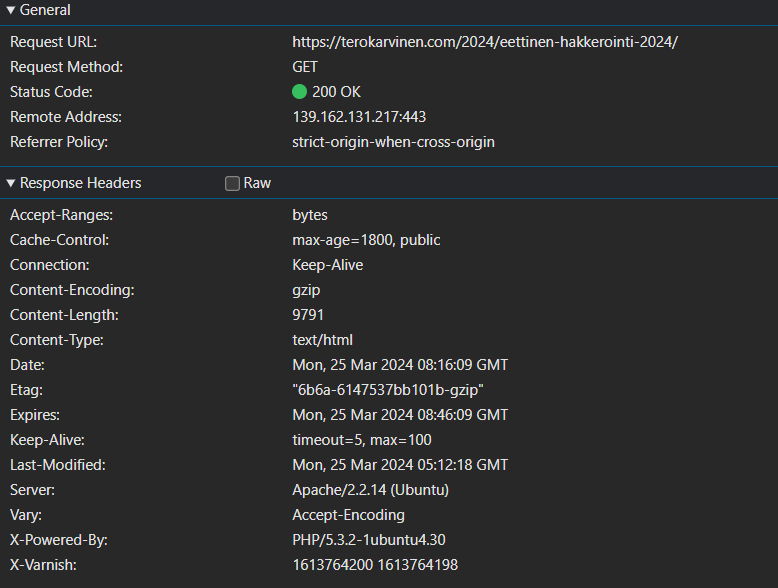

Tarkastin googlen inspect kehittäjä työkalulla [https://terokarvinen.com/2024/eettinen-hakkerointi-2024/#kertausmateriaalia] sivua.
Menin Network asetuksiin ja katsoin mitä sivusto lataa. 

Avasin ensimmäisen resurssin ja sen header osiosta voidaan nähdä mihin pyyntö on tehty ja mitä se palauttaa.
Tässä esimerkissä Request Method on GET ja status koodina palautuu 200, eli onnistunut pyyntö.

Esimerkissä näkyy mikä palvelin osoite on. 
`139.162.131.217:443` on palvelimen IP-osoite ja portti numero. 
Esimerkistä voidaan nähdä `Content-Length` joka palauttaa vastauksen koon tavuina. 
Palvelimena käytetään apachea ja sen versiota 2.2.14.
