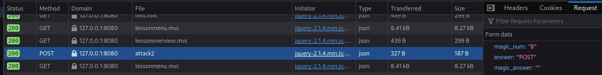
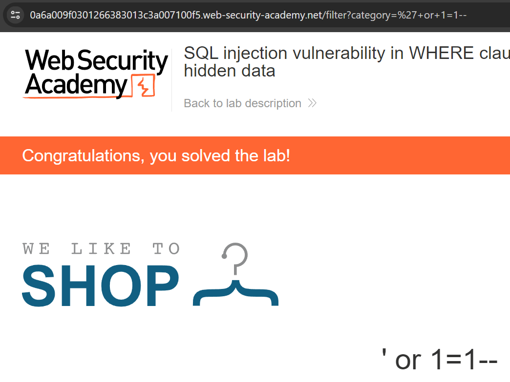

## X Lue ja tiivistä
- kesken
  
## Over the wire
Lähdin suorittamaan over the wiren bandit- haasteen kolmea ensimmäistä tehtävää.

Ensimmäisessä tehtävässä Muodostin SSH-yhteyden Bandit-nimiseen palvelimeen käyttämällä seuraavaa komentoa: `ssh bandit0@bandit.labs.overthewire.org -p 2220`
Syötin pyydetyssä kohdassa salasanan `bandit0`, mikä päästi minut sisälle. 


Kotihakemistossa suoritin komennon `cat readme`, joka tulosti terminaaliin seuraavan tason salasanan.


Seuraavassa osassa salasana sijaitsi `-` -nimisessä tiedostossa. Tässä tapauksessa käytin komentoa `cat ./-`, jotta komento ymmärsi, että `-` on tiedostonimi.


# webgoat
Latasin webgoatin kali linuxille lataamalla ensin webgoatin omalta sivulta jar -tiedsoton. Ajoin `java -jar webgoat-2023.8.jar` -komennon, joka asensi webgoatin.


Ensimmäisessä osassa tuli syöttää käyttäjä nimi kenttään.


Toisessa osassa tuli selvittää oliko pyyntö POST vai GET ja magic number. Nämä vastauksen löytyi inspectaamalla sivua, Network osiosta.



DEVTOOLS
Ensimmäisessä tehtävässä tuli devtoolsia käyttäen syöttää consoleen tietty komento, josta sai vastauksen tehtävään.


Seuraavassa tehtävässä vastaukset tehtävään löytyi jälleen devtoolsin Network osiosta.


## portswigger

Tehtävässä oli tavoitteena hyödyntää sql injektiota.


Kuvassa osoite, jossa näkyy kuinka kategorioita haetaan.

Lisäsin osoitteen perään SQL -koodin`'+or1+1--`, joka pakotti tietokantakyselyn palauttamaan kaikki tuotteet, riippumatta niiden julkaisutilasta.
`https://0acf001904eb2ed08050c16b00d70009.web-security-academy.net/filter?category=%27+or+1=1--`



## Linux virtuaalikoneeseen
Latasin kali linuxin oracle vm virtualboxiin. Latasin "pre-built" Kalin sen [viralliselta sivulta](https://www.kali.org/get-kali/#kali-virtual-machines) ja virtualboxissa valitsin add ja valitsin ladatun kalin, joka tuli ns. valmiina pakettina.

## porttiskannaa 1000 tavallisinta porttia
Tein tehtäviä kali linux virtuaalikoneella. 

Annoin komennon `sudo nmap -p 1-1000 localhost`, joka ei nähnyt avoimia portteja. 


# skannaa kaikki portit
Ajoin komennon `sudo nmap -p- localhost`, joka näytti, että portit 8080 ja 9090 ovat auki.


`8080/tcp` on `http-proxy` palvelu. 

`9090/tcp` -portin nmap tunnistaa jostain syystä `zeus-admin`.  
Tarkistaakseni mikä ohjelma portilla oikeasti kuuntelee ajoin komennon `sudo netstat -tulnp | grep 9090`
Tämä palautti: 
```
tcp6       0      0 127.0.0.1:9090          :::*                    LISTEN      15076/java
```
Tästä selvisi, että porttia kuuntelee prosessi, joka on merkitty suoritettavaksi javalla. 
Ajoin vielä komennon `ps -f -p 15076` 
```
UID          PID    PPID  C STIME TTY          TIME CMD
kali       15076   14514  1 03:02 pts/2    00:01:22 java -jar webgoat-2023.8.jar
```

Tämä paljasti, että portilla kuuntelee webgoat. Koska en enää webgoatia käytä ajoin komennon `sudo kill -SIGTERM 15076`, joka tappoi prosessin.

## laaja porttiskanni
Ajoin komennon `sudo nmap -A -p- localhost`

```
Starting Nmap 7.94SVN ( https://nmap.org ) at 2024-04-03 05:19 EDT
Nmap scan report for localhost (127.0.0.1)
Host is up (0.000022s latency).
Other addresses for localhost (not scanned): ::1
All 65535 scanned ports on localhost (127.0.0.1) are in ignored states.
Not shown: 65535 closed tcp ports (reset)
Too many fingerprints match this host to give specific OS details
Network Distance: 0 hops

OS and Service detection performed. Please report any incorrect results at https://nmap.org/submit/ .
Nmap done: 1 IP address (1 host up) scanned in 2.49 seconds
```
Tulosten perusteella kaikki 65535 porttia ovat suljettuja. 

## Porttiskannaus apache
Latasin apachen koneelle ja laitoin sen päälle.

```
sudo nmap -A -p- localhost

Starting Nmap 7.94SVN ( https://nmap.org ) at 2024-04-03 05:26 EDT
Nmap scan report for localhost (127.0.0.1)
Host is up (0.000028s latency).
Other addresses for localhost (not scanned): ::1
Not shown: 65534 closed tcp ports (reset)
PORT   STATE SERVICE VERSION
80/tcp open  http    Apache httpd 2.4.58 ((Debian))
|_http-title: Apache2 Debian Default Page: It works
|_http-server-header: Apache/2.4.58 (Debian)
No exact OS matches for host (If you know what OS is running on it, see https://nmap.org/submit/ ).
TCP/IP fingerprint:
OS:SCAN(V=7.94SVN%E=4%D=4/3%OT=80%CT=1%CU=35904%PV=N%DS=0%DC=L%G=Y%TM=660D2
OS:0BC%P=x86_64-pc-linux-gnu)SEQ(SP=108%GCD=1%ISR=109%TI=Z%CI=Z%II=I%TS=A)O
OS:PS(O1=MFFD7ST11NW7%O2=MFFD7ST11NW7%O3=MFFD7NNT11NW7%O4=MFFD7ST11NW7%O5=M
OS:FFD7ST11NW7%O6=MFFD7ST11)WIN(W1=8200%W2=8200%W3=8200%W4=8200%W5=8200%W6=
OS:8200)ECN(R=Y%DF=Y%T=40%W=8200%O=MFFD7NNSNW7%CC=Y%Q=)T1(R=Y%DF=Y%T=40%S=O
OS:%A=S+%F=AS%RD=0%Q=)T2(R=N)T3(R=N)T4(R=Y%DF=Y%T=40%W=0%S=A%A=Z%F=R%O=%RD=
OS:0%Q=)T5(R=Y%DF=Y%T=40%W=0%S=Z%A=S+%F=AR%O=%RD=0%Q=)T6(R=Y%DF=Y%T=40%W=0%
OS:S=A%A=Z%F=R%O=%RD=0%Q=)T7(R=Y%DF=Y%T=40%W=0%S=Z%A=S+%F=AR%O=%RD=0%Q=)U1(
OS:R=Y%DF=N%T=40%IPL=164%UN=0%RIPL=G%RID=G%RIPCK=G%RUCK=G%RUD=G)IE(R=Y%DFI=
OS:N%T=40%CD=S)

Network Distance: 0 hops

OS and Service detection performed. Please report any incorrect results at https://nmap.org/submit/ .
Nmap done: 1 IP address (1 host up) scanned in 18.57 seconds

```

Apache avasi portin 80, joka oli odotettu muutos.


## Avoimen lähteen tiedustelu
Päätin kokeille [haveibeenpwned](https://haveibeenpwned.com/) verkkosivua tiedusteluun. Sivulla voi tarkistaa onko sähköpostiosoitteeella vuotaneita salasanoja. 


## Lähteet
- Karvinen, T. 2024. Tunkeutumistestaus. Luettavissa: https://terokarvinen.com/2024/eettinen-hakkerointi-2024/
- Over The Wire, Bandit: https://overthewire.org/wargames/bandit/
- Kali Linux: https://www.kali.org/get-kali/#kali-virtual-machines
