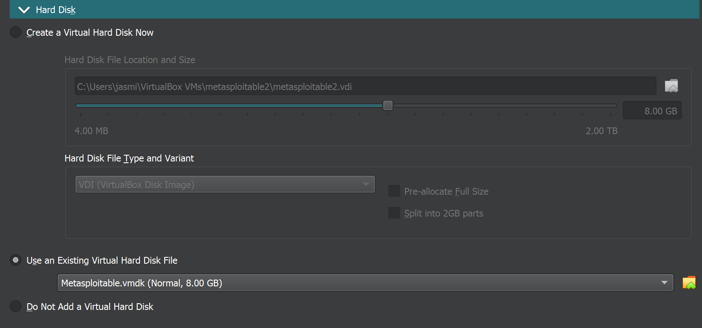
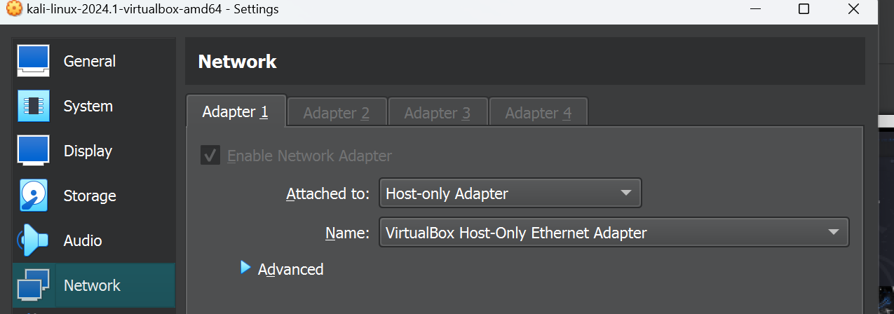
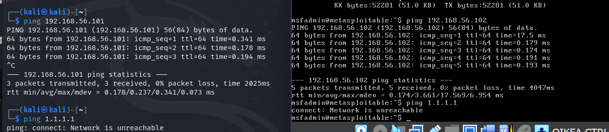
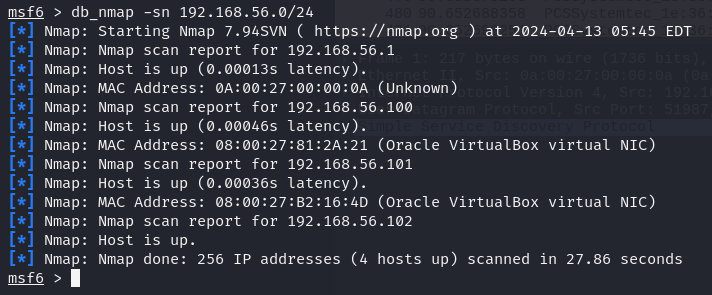
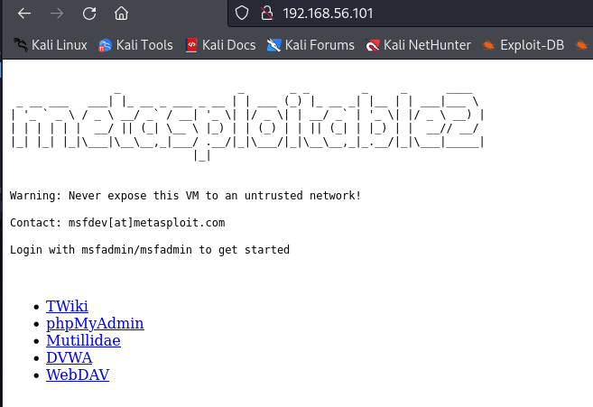
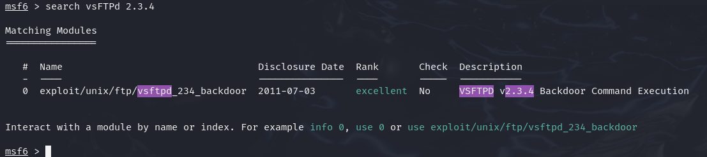
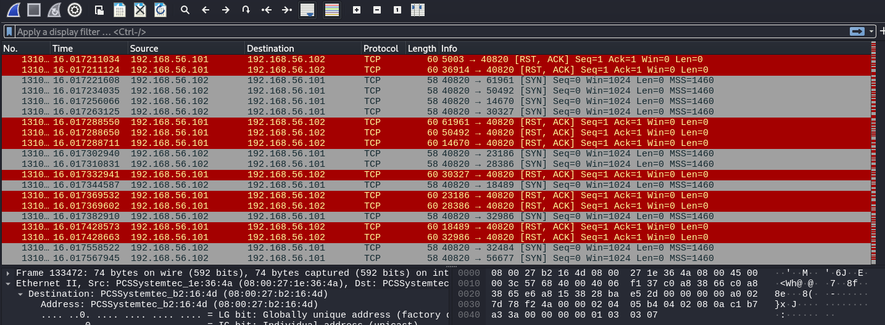
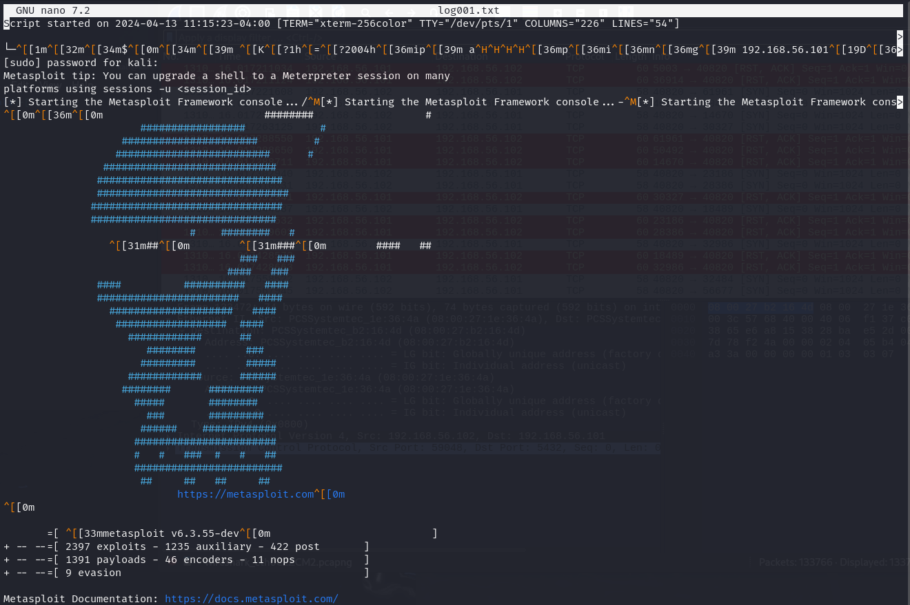
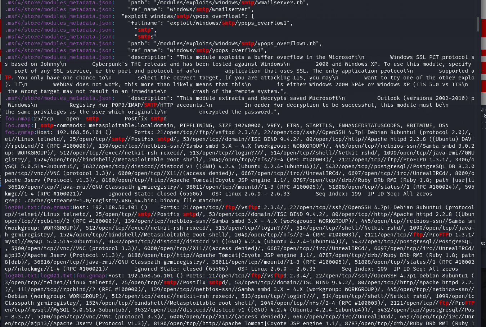

## x
#### Port Scanning Basics
Nmap erottelee portit eri tiloihin.
- Open: Portti, jossa sovellus aktiivisesti hyväksyy TCP-yhteyksiä, UDP-datagrammeja tai SCTP-assosiaatioita.
- Closed: Portti on saavutettavissa ja vastaa Nmapin tiedustelu paketteihin, mutta siinä ei ole kuuntelevaa sovellusta
- Filtered: Nmap ei voi määrittää, onko portti avoin vai ei, koska pakettisuodatus estää pakettien saapumisen porttiin.
#### Port Scanning Techniques
- -sS (TCP SYN scan)
	- Oletusskannaustyyppi ja suosituin vaihtoehto
	- Skannaa nopeasti tuhansia portteja sekunnissa 
	- "half-open scanning", jossa ei muodosteta täyttä TCP-yhteyttä.
	- Lähettää SYN-paketin ja odottaa vastausta; SYN/ACK viestii avoimesta portista, kun taas RST viestii, että portti ei ole kuuntelussa.
	- Portti merkataan "filtered", jos vastausta ei saada.
- -sT (TCP connect scan)
	- Oletus skannaustyyppi kun -sS scanni ei ole käytettävissä
	- Vähemmän tehokas kuin -sS
- -sU
	- Tärkeä UDP skannaukseen.
	- Lähettää UDP-paketin jokaiseen kohdistettuun porttiin. Vastaukset, tai niiden puuttuminen määrittelevät portin tilan.
	


## Kalin asennus
Kalin asentamisen tein edellisellä viikolla ja jatkoin samalla koneella tehtävien tekoa, joten en uudelleen asentanut konetta. 

## metasploitable
Tämän tehtävän kerkesin tehdä tunnilla ja raportti on kirjoitettu ulkomuistista. 
Metasploitable 2 latasin [sourceforgen](https://sourceforge.net/projects/metasploitable/) sivuilta. Metasploitablen asennus oli lähes tulkoon samanlaista kuin muidenkin virtuaalikoneiden. Ainoana poikkeuksena oli Hard Disk kohdassa valita `Use an Existing Virtual Hard Disk File` ja valita metasploitable.vmdk.



## Virtuaaliverkko
Tein molemmille koneille virtuaaliverkon vm virtualboxin asetuksissa network välilehdellä. Laitoin molemmille koneille "attached to" -kohtaan Host-only Adapter.



Tarkistin molemmilla koneilla, että ne saavat yhteyden toisiinsa, mutta ei internettiin.



## d)
Laitoin kali linuxissa PostgreSQL-palvelun päälle `sudo service postgresql start` -komennolla.
Seuraavaksi alustin Metasploit-tietokannan `sudo msfdb init` komennolla. 
Avasin metasploitable konsolin `msfconsole` -komennolla.

Metasloitable konsolissa ajoin komennon `db_nmap -sn 192.168.56.0/24`. Tämä komento skannaa kaikki IP-osoitteet määritellyltä alueelta, käyttämättä porttitietoja.



Kun IP-osoite oli tunnistettu, varmistin osoitteen oikeellisuuden avaamalla selaimen ja kirjoittamalla osoiteriville löydetyn IP:n. Metasploitablen web-palvelimen etusivulla näkyi selkeästi teksti "Metasploitable", mikä vahvisti, että oikea järjestelmä oli löydetty.



## e)

Käytin `db_nmap -A -p0- 192.168.56.101` komentoa Metasploitable-koneen porttiskannaukseen. Tämä komento skannaa kaikki mahdolliset tcp portit (0-65535) ja kerää tietoja käynnissä olevista palveluista, niiden versioista sekä käyttöjärjestelmästä.

```
db_nmap -A -p0- 192.168.56.101
[*] Nmap: Starting Nmap 7.94SVN ( https://nmap.org ) at 2024-04-13 06:13 EDT
[*] Nmap: Nmap scan report for 192.168.56.101                             
[*] Nmap: Host is up (0.00027s latency).                                     
[*] Nmap: Not shown: 65506 closed tcp ports (reset)                          
[*] Nmap: PORT      STATE SERVICE     VERSION                                               
[*] Nmap: 21/tcp    open  ftp         vsftpd 2.3.4                                          
[*] Nmap: | ftp-syst:                                                                       
[*] Nmap: |   STAT:                                                                         
[*] Nmap: | FTP server status:                                                              
[*] Nmap: |      Connected to 192.168.56.102                                                
[*] Nmap: |      Logged in as ftp                                                           
[*] Nmap: |      TYPE: ASCII
[*] Nmap: |      No session bandwidth limit
[*] Nmap: |      Session timeout in seconds is 300
[*] Nmap: |      Control connection is plain text
[*] Nmap: |      Data connections will be plain text
[*] Nmap: |      vsFTPd 2.3.4 - secure, fast, stable
[*] Nmap: |_End of status
[*] Nmap: |_ftp-anon: Anonymous FTP login allowed (FTP code 230)
[*] Nmap: 22/tcp    open  ssh         OpenSSH 4.7p1 Debian 8ubuntu1 (protocol 2.0)
[*] Nmap: | ssh-hostkey:
[*] Nmap: |   1024 60:0f:cf:e1:c0:5f:6a:74:d6:90:24:fa:c4:d5:6c:cd (DSA)
[*] Nmap: |_  2048 56:56:24:0f:21:1d:de:a7:2b:ae:61:b1:24:3d:e8:f3 (RSA)
[*] Nmap: 23/tcp    open  telnet      Linux telnetd
[*] Nmap: 25/tcp    open  smtp        Postfix smtpd
[*] Nmap: |_ssl-date: 2024-04-11T20:47:23+00:00; -1d13h29m01s from scanner time.
[*] Nmap: | sslv2:
[*] Nmap: |   SSLv2 supported
[*] Nmap: |   ciphers:
[*] Nmap: |     SSL2_RC4_128_EXPORT40_WITH_MD5
[*] Nmap: |     SSL2_RC2_128_CBC_EXPORT40_WITH_MD5
[*] Nmap: |     SSL2_RC4_128_WITH_MD5
[*] Nmap: |     SSL2_DES_64_CBC_WITH_MD5
[*] Nmap: |     SSL2_RC2_128_CBC_WITH_MD5
[*] Nmap: |_    SSL2_DES_192_EDE3_CBC_WITH_MD5
[*] Nmap: |_smtp-commands: metasploitable.localdomain, PIPELINING, SIZE 10240000, VRFY, ETRN, STARTTLS, ENHANCEDSTATUSCODES, 8BITMIME, DSN
[*] Nmap: | ssl-cert: Subject: commonName=ubuntu804-base.localdomain/organizationName=OCOSA/stateOrProvinceName=There is no such thing outside US/countryName=XX
[*] Nmap: | Not valid before: 2010-03-17T14:07:45
[*] Nmap: |_Not valid after:  2010-04-16T14:07:45
[*] Nmap: 53/tcp    open  domain      ISC BIND 9.4.2
[*] Nmap: | dns-nsid:
[*] Nmap: |_  bind.version: 9.4.2
[*] Nmap: 80/tcp    open  http        Apache httpd 2.2.8 ((Ubuntu) DAV/2)
[*] Nmap: |_http-title: Metasploitable2 - Linux
[*] Nmap: |_http-server-header: Apache/2.2.8 (Ubuntu) DAV/2
[*] Nmap: 111/tcp   open  rpcbind     2 (RPC #100000)
[*] Nmap: | rpcinfo:
[*] Nmap: |   program version    port/proto  service
[*] Nmap: |   100000  2            111/tcp   rpcbind
[*] Nmap: |   100000  2            111/udp   rpcbind
[*] Nmap: |   100003  2,3,4       2049/tcp   nfs
[*] Nmap: |   100003  2,3,4       2049/udp   nfs
[*] Nmap: |   100005  1,2,3      35751/udp   mountd
[*] Nmap: |   100005  1,2,3      38011/tcp   mountd
[*] Nmap: |   100021  1,3,4      42331/udp   nlockmgr
[*] Nmap: |   100021  1,3,4      59550/tcp   nlockmgr
[*] Nmap: |   100024  1          51808/tcp   status
[*] Nmap: |_  100024  1          60201/udp   status
[*] Nmap: 139/tcp   open  netbios-ssn Samba smbd 3.X - 4.X (workgroup: WORKGROUP)
[*] Nmap: 445/tcp   open  netbios-ssn Samba smbd 3.0.20-Debian (workgroup: WORKGROUP)
[*] Nmap: 512/tcp   open  exec        netkit-rsh rexecd
[*] Nmap: 513/tcp   open  login       OpenBSD or Solaris rlogind
[*] Nmap: 514/tcp   open  shell       Netkit rshd
[*] Nmap: 1099/tcp  open  java-rmi    GNU Classpath grmiregistry
[*] Nmap: 1524/tcp  open  bindshell   Metasploitable root shell
[*] Nmap: 2049/tcp  open  nfs         2-4 (RPC #100003)
[*] Nmap: 2121/tcp  open  ftp         ProFTPD 1.3.1
[*] Nmap: 3306/tcp  open  mysql       MySQL 5.0.51a-3ubuntu5
[*] Nmap: | mysql-info:
[*] Nmap: |   Protocol: 10
[*] Nmap: |   Version: 5.0.51a-3ubuntu5
[*] Nmap: |   Thread ID: 8
[*] Nmap: |   Capabilities flags: 43564
[*] Nmap: |   Some Capabilities: Support41Auth, LongColumnFlag, SupportsCompression, SupportsTransactions, ConnectWithDatabase, Speaks41ProtocolNew, SwitchToSSLAfterHandshake
[*] Nmap: |   Status: Autocommit
[*] Nmap: |_  Salt: ;*_#.\gnrp_jt,y?m*'#
[*] Nmap: 3632/tcp  open  distccd     distccd v1 ((GNU) 4.2.4 (Ubuntu 4.2.4-1ubuntu4))
[*] Nmap: 5432/tcp  open  postgresql  PostgreSQL DB 8.3.0 - 8.3.7
[*] Nmap: |_ssl-date: 2024-04-11T20:47:23+00:00; -1d13h29m01s from scanner time.
[*] Nmap: | ssl-cert: Subject: commonName=ubuntu804-base.localdomain/organizationName=OCOSA/stateOrProvinceName=There is no such thing outside US/countryName=XX
[*] Nmap: | Not valid before: 2010-03-17T14:07:45
[*] Nmap: |_Not valid after:  2010-04-16T14:07:45
[*] Nmap: 5900/tcp  open  vnc         VNC (protocol 3.3)
[*] Nmap: | vnc-info:
[*] Nmap: |   Protocol version: 3.3
[*] Nmap: |   Security types:
[*] Nmap: |_    VNC Authentication (2)
[*] Nmap: 6000/tcp  open  X11         (access denied)
[*] Nmap: 6667/tcp  open  irc         UnrealIRCd
[*] Nmap: 6697/tcp  open  irc         UnrealIRCd
[*] Nmap: 8009/tcp  open  ajp13       Apache Jserv (Protocol v1.3)
[*] Nmap: |_ajp-methods: Failed to get a valid response for the OPTION request
[*] Nmap: 8180/tcp  open  http        Apache Tomcat/Coyote JSP engine 1.1
[*] Nmap: |_http-server-header: Apache-Coyote/1.1
[*] Nmap: |_http-favicon: Apache Tomcat
[*] Nmap: |_http-title: Apache Tomcat/5.5
[*] Nmap: 8787/tcp  open  drb         Ruby DRb RMI (Ruby 1.8; path /usr/lib/ruby/1.8/drb)
[*] Nmap: 36816/tcp open  java-rmi    GNU Classpath grmiregistry
[*] Nmap: 38011/tcp open  mountd      1-3 (RPC #100005)
[*] Nmap: 51808/tcp open  status      1 (RPC #100024)
[*] Nmap: 59550/tcp open  nlockmgr    1-4 (RPC #100021)
[*] Nmap: MAC Address: 08:00:27:B2:16:4D (Oracle VirtualBox virtual NIC)
[*] Nmap: Device type: general purpose
[*] Nmap: Running: Linux 2.6.X
[*] Nmap: OS CPE: cpe:/o:linux:linux_kernel:2.6
[*] Nmap: OS details: Linux 2.6.9 - 2.6.33
[*] Nmap: Network Distance: 1 hop
[*] Nmap: Service Info: Hosts:  metasploitable.localdomain, irc.Metasploitable.LAN; OSs: Unix, Linux; CPE: cpe:/o:linux:linux_kernel
[*] Nmap: Host script results:
[*] Nmap: |_nbstat: NetBIOS name: METASPLOITABLE, NetBIOS user: <unknown>, NetBIOS MAC: <unknown> (unknown)
[*] Nmap: | smb-security-mode:
[*] Nmap: |   account_used: <blank>
[*] Nmap: |   authentication_level: user
[*] Nmap: |   challenge_response: supported
[*] Nmap: |_  message_signing: disabled (dangerous, but default)
[*] Nmap: |_smb2-time: Protocol negotiation failed (SMB2)
[*] Nmap: | smb-os-discovery:
[*] Nmap: |   OS: Unix (Samba 3.0.20-Debian)
[*] Nmap: |   Computer name: metasploitable
[*] Nmap: |   NetBIOS computer name:
[*] Nmap: |   Domain name: localdomain
[*] Nmap: |   FQDN: metasploitable.localdomain
[*] Nmap: |_  System time: 2024-04-11T16:47:13-04:00
[*] Nmap: |_clock-skew: mean: -1d12h29m01s, deviation: 2h00m00s, median: -1d13h29m01s
[*] Nmap: TRACEROUTE
[*] Nmap: HOP RTT     ADDRESS
[*] Nmap: 1   0.27 ms 192.168.56.101
[*] Nmap: OS and Service detection performed. Please report any incorrect results at https://nmap.org/submit/ .
[*] Nmap: Nmap done: 1 IP address (1 host up) scanned in 153.62 seconds

```

Skannauksen tulokset paljastivat useita avoimia portteja ja niissä toimivia palveluita. Joitakin havaintoja:
- 21/tcp (FTP) vsftpd 2.3.4. Hyödynsin Metasploitin `search`-toimintoa tarkistaakseni tämän version haavoittuvuudet  `search vsFTPd 2.3.4`


  
- 23/tcp (Telnet). Telnet on vanhentunut ja turvaton protokolla, joka siirtää kaikki tiedot salaamattomana.

Useimmat havaitut palvelut ovat vanhentuneita ja konfiguroitu turvattomasti. Metasploitable on tarkoituksellisesti erittäin haavoittuvainen järjestelmä ja suunniteltu käytettävän harjoitusympäristönä. Tuotantoympäristössä palveluiden tulisi olla ajantasalla turvapäivitysten suhteen ja käytössä tulisi olla muita lisäturvatoimia.

Skannauksen aikana wiresharkissa näkyi paljon paketteja. 



## f) 
Ajoin komennon `db_nmap -A -p0- -oA foo 192.168.56.101` joka tallentaa porttiskannauksen tuloksen tiedostoon.


## g)
Ajoin komennon `script -fa log001.txt`, joka tallentaa shell istunnon toiminnot.
- `-f` (flush) vaihtoehto varmistaa, että tiedostoon kirjoitetaan reaaliajassa, mikä tarkoittaa, että jokainen tuloste kirjoitetaan tiedostoon heti sen ilmestyessä näytölle.
- `-a` (append) vaihtoehto lisää tulosteet olemassa olevaan tiedostoon, sen sijaan että ylikirjoittaisi sen.



## h)
Ajoin komennon `grep -ir smtp` 
- -i (ignore case): Varmistaa, että haku on kirjainkokoriippumaton, eli löytää "SMTP", "smtp" ja muut variantit.
- -r (recursive): Mahdollistaa rekursiivisen haun, joka ulottuu kaikkiin alihakemistoihin.

Komennolla tuli paljon tuloksia. Tässä esimerkissä näkyy osa, jotka on tallentuneet foo.nmap ja log001.txt tiedostoihin.



## i)
Nmap tarjoaa ajonaikaisia interaktiivisia  toimintoja. Nämä on hyödyllisiä jos halutaan reaaliajassa hallita skannauksen suorituskykyä. Muutamia esimerkkejä ajonaikaisista toiminnoista:
- p/P packet tracing.
- d/D debug taso
- ? näyttää apu sivun.

## Lähteet
https://terokarvinen.com/2024/eettinen-hakkerointi-2024/

https://nmap.org/book/man-port-scanning-basics.html

https://nmap.org/book/man-port-scanning-techniques.html

https://sourceforge.net/projects/metasploitable/files/Metasploitable2/
