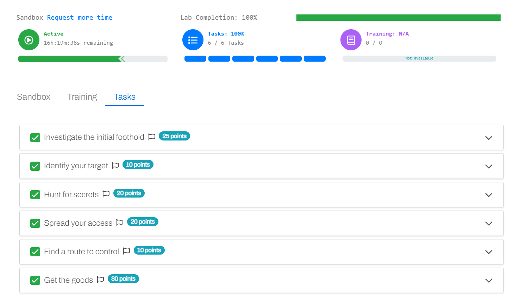

## x)
[BloodHound](https://github.com/BloodHoundAD/BloodHound) on ohjelma, jota käytetään Active Directory ympäristöjen tietoturva-aukkojen visualisointiin. 
Ohjelmisto mahdollistaa käyttäjien ja ryhmien välisten suhteiden visualisoinnin, mikä auttaa havainnoillistamaan hyökkäyspolut ja haavoittuvuudet organisaatioiden verkoissa.

## a) withsecuren haaste
Sain ratkaistua Withsecuren haasteen.

## Lähteet
https://terokarvinen.com/2024/eettinen-hakkerointi-2024/

https://github.com/S1ckB0y1337/Active-Directory-Exploitation-Cheat-Sheet (<- Erittäin hyvä AD exploit cheat sheet!)

https://github.com/BloodHoundAD/BloodHound

https://github.com/fortra/impacket

https://github.com/PowerShellMafia/PowerSploit/tree/master
