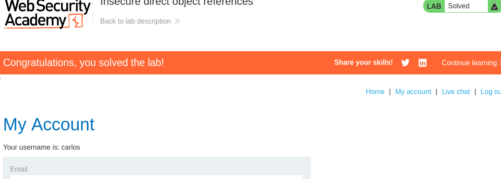
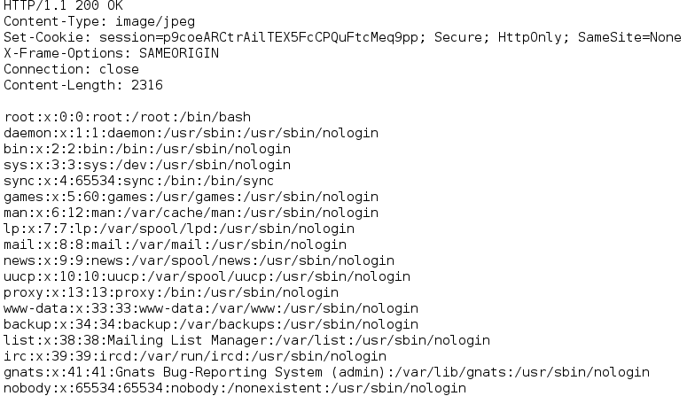

## x)
[Broken access control](https://owasp.org/Top10/A01_2021-Broken_Access_Control/)
- Rikkinäinen pääsynhallinta on OWASP:n vuoden 2021 Top 10 -listan kärjessä.
- Tämä haavoittuvuus ilmenee, kun sovellus ei pysty kunnolla varmistamaan käyttäjien oikeuksia, mikä johtaa luvattomaan tietojen käyttöön tai muuttamiseen. 
- Esimerkiksi URL-osoitteiden muuttaminen pääsynhallinnan kiertämiseksi
[Server-Side Request Forgery (SSRF)](https://owasp.org/Top10/A10_2021-Server-Side_Request_Forgery_%28SSRF%29/)
- SSRF-hyökkäykset ovat hyökkäystyyppi, joka hyödyntää palvelinpuolen sovelluksia pakottamalla ne tekemään haitallisia verkkopyyntöjä.

[Insecure direct object references (IDOR)](https://portswigger.net/web-security/access-control/idor)
- Insecure Direct Object Reference (IDOR) on pääsynhallinnan haavoittuvuus, jossa sovellus käyttää käyttäjän antamaa tietoa  tietokanta- tai tiedosto-objekteihin.

[Path traversal](https://portswigger.net/web-security/file-path-traversal)
- File path traversal on haavoittuvuus, jossa hyökkääjä voi käyttää tiedostoja, joihin hänen ei pitäisi päästä. Tämä tapahtuu manipuloimalla hakemistopolkuja, kuten käyttämällä merkintöjä `../`, jotka siirtävät hakemistopolkua taaksepäin.

[Server-side template injection](https://portswigger.net/web-security/server-side-template-injection)
- Server-side template injection (SSTI) on haavoittuvuus, jossa käyttäjän syöte pääsee osaksi mallipohjaa (template). Hyökkääjä voi näin lisätä haitallista koodia, joka suoritetaan palvelimella. 

## a&b)
Kerkesin zapin ja foxyproxyn asentaa tunnilla. 
Testasin että ZAPissa näkyy liikennettä.

Kävin lisäämässä proxies sivulla halutut patternit.

## c)
Käyttäjien chat-lokit tallennettiin palvelimelle tekstitiedostoina, joihin pääsi käsiksi staattisten URL-osoitteiden kautta. Tavoitteena oli löytää käyttäjän "carlos" salasana chat-lokeista ja kirjautua sisään hänen tililleen käyttäen löydettyä salasanaa.
Aluksi navigoitiin sovelluksen "Live chat" -osioon ja lähetettiin viesti. 
Tämän jälkeen valittiin "View transcript" -toiminto, joka avasi näkymän chatin viestiketjusta tekstitiedostona. 
URL-osoite, joka sisälsi viestiketjun, oli muodossa `ttps://0aff001803eb5ee68044219400760072.web-security-academy.net/download-transcript/3.txt`

Tästä muutettiin txt -tiedoston numeroa, jonka avulla löytyi carlosin chat logi, josta selvisi salasana.

## d)
Tavoitteena oli päästä käsiksi  /etc/passwd -tiedostoon.

Etsin zapista pyynnön joka vastasi kuvan lataamisesta. Kun löysin `filename` parametrin, käytin `resend with request editor` ominaisuutta ja lisäsin pyynnön perään `../etc/passwd`

Muokatun pyynnön uudelleenlähetys onnistui, ja ZAPin vastaus-välilehti näytti palvelimen palauttaman `/etc/passwd` -tiedoston sisällön

## e)
Muokkasin suoraan tuotekuvien lataukseen käytettyä URLia lisäämällä `filename`-parametrin perään `/etc/passwd`.

(Kuvassa ei näy oikein `/etc/passwd`, mutta 20.jpg korvattiin tällä)

Pyyntö palautti `/etc/passwd` -tiedoston sisällön.

## f)
Ratkaisin tehtävän samaan tapaan kuin edelliset. 
Tehtävä pyrki poistamaan polun ylitys yritykset kuten `../`. Sovellus poisti nämä ei rekursiivisesti, joten kokeilin lisätä kaksi pistettä lisää. 
Tässä `....//` toimii tavalla, että ensimmäinen puhdistusprosessi poistaa kaksi pistettä kustakin neljän pisteen ryhmästä, jolloin jäljelle jäävä `../` pääsee läpi suodatuksesta.

## g)
Testasin syöttää tuotteen kuvaukseen random syntaksia, joka ei mennyt läpi. Tästä selvisi, että sovellus käyttää djangoa.

Kävin läpi djangon dokumentaatiota tageista ja filttereistä. Täältä löytyi debug kohta jota testasin. [debug](https://docs.djangoproject.com/en/5.0/ref/templates/builtins/#debug)

Tästä selvisi, että meillä on pääsy settingsiin.
Kokeilin pelkästään settings syntaksia, joka palautti epäolennaista tietoa.

Koska tehtävän kuvauksessa mainittiin ' find secret key', päätin kokeille kyseistä syntaksia. Jälkikäteen katsoin vielä djangon dokumentaatiosta tämän: https://docs.djangoproject.com/en/5.0/ref/settings/#debug

## h)
Löysin tuotesivulta 'check stock' napin, jota testasin painaa. 
Zapiin ilmestyi pyyntö, joka käytti stockApi:a, jonka parametrin muutin 'localhost/admin'.

Tarkastelin html -koodia, josta löysin users kohdan. Laitoin apin parametriksi nyt 'localhost/admin/delete?username=carlos'.
Tämä poisti käyttäjän.

## i)
Sivulla oli hakukenttä, jossa käyttäjän antamat hakusanat heijastettiin hakutuloksiin. 
Syötin kenttään ``.
Hakutulos suoritti koodin ja näytölle tuli alert-ikkuna.

## j)
Navigoin blogipostauksiin ja niiden kommentti osioon.
Laitoin kommenttiin `` ja täytin muut kentät ja lähetin kommentin. 

Portswigger jo tässä vaiheessa ilmoitti, että harjoitus oli tehty, mutta painoin sivulla vielä 'Back to blog' linkkiä, jotta varmistuin onnistumisesta.

## k)
Asensin webgoatin 2023.4 version.

## i)
-

## m)
##### Hijack a session
suoritus vaiheessa

#### Insecure Direct Object References
Authenticate First, Abuse Authorization Later:
Tässä kohdassa tuli kirjautua sisään annetulla tunnuksella. 

Observing Differences & Behaviors:
Seuravassa osassa tuli etsiä kaksi attribuuttia, joita ei oltu sivulla listattu.

Kolmannessa tehtävässä tuli kirjoittaa vaihtoehtoinen Url omaan profiiliin. Tähän vastaus löytyi edellisen tehtävän "userId" kohdasta.
`/WebGoat/IDOR/profile/{id}`

Seuraavassa tehtävässä piti löytää toinen käyttäjä.
Käytin zapin fuzzeria ja laitoin sen fuzzaamaan 100 seuraavaa numeroa minun käyttäjän id:stä, jolloin löysin toisen käyttäjän id:n.

Muokkasin käyttäjän tietoja put pyynnöllä devtoolsissa. lisäämällä body kenttään json muodossa tietoa.

#### Missing Function Level Access Control
Ensimmäisessä tehtävässä tuli html -koodista löytää piilotettu menu. Täältä löytyi Users ja Config.

Toinen tehtävä kesken.

## n)
Authentication Bypasses:

## o)
#### Server-Side Request Forgery
Find and modify the request to display Jerry:
Painoin sivulla steal cheese nappia ja katsoin mitä pyyntöjä ZAPiin ilmestyi. Sieltä löytyi task1 ja `https://127.0.0.1:8080/WebGoat/images/tom.png`.
Testasin ensiksi muokata vain urlia `images/jerry.png`, tämä palautti jerry kuvan.

Change the request, so the server gets information from `http://ifconfig.pro`:
Toisessa tehtävässä jälleen painoin sivulla näkynyttä painiketta. Katsoin mitä pyyntöjä ZAPiin tuli. Huomasin siellä task2. Muokkasin Url -kenttää ja sain tehtävän suoritettua.

## p) 
##### Bypass front-end restrictions
Field Restrictions:
Muokkasin zapissa input kenttiä, jolla sain tehtävän suoritettua.

Validation:
Muokkasin jälleen zapissa syötekenttiä siten, ettei ne vastanneet sivulla määriteltyjä rajoituksia.

## Lähteet
https://terokarvinen.com/2024/eettinen-hakkerointi-2024/

https://owasp.org/Top10/A01_2021-Broken_Access_Control/

https://owasp.org/Top10/A10_2021-Server-Side_Request_Forgery_%28SSRF%29/

https://portswigger.net/web-security/access-control/idor

https://portswigger.net/web-security/file-path-traversal

https://portswigger.net/web-security/server-side-template-injection

https://portswigger.net/web-security/ssrf

https://portswigger.net/web-security/cross-site-scripting

https://terokarvinen.com/2023/webgoat-2023-4-ethical-web-hacking/

https://docs.djangoproject.com/en/5.0/ref/templates/builtins/#debug
